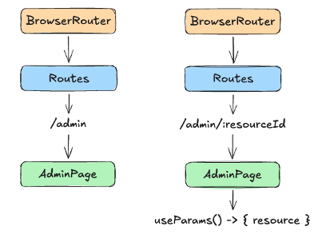

# SDEV2150
## Lesson 18: Dynamic Routing with React Router 7

Using URL parameters to build data‑driven interfaces.

---

## Lesson Objectives

In this lesson, students will:

- Define dynamic routes using URL parameters
- Use the `useParams()` hook to read route values
- Navigate programmatically using `useNavigate()`
- Build route‑driven interfaces where the URL represents application state

---

## Agenda

- Review static routing
- Understanding dynamic routes
- URL parameters and route matching
- Reading parameters with `useParams()`
- Navigating programmatically
- Designing route‑driven UIs

---
layout: nait-main-cover
---

# Connecting

---

## Real‑world examples of dynamic routes

Many real websites use URLs with parameters.

Examples:

- `/products/42`
- `/users/135`
- `/courses/DMIT1508`

The **structure of the page stays the same**, but the **content changes based on the parameter**.

---

## Why dynamic routes matter

Dynamic routes allow applications to:

- Reuse a single page component
- Load different data based on the URL
- Support bookmarking and sharing
- Represent application state in the address bar

The URL becomes part of the application logic.

---
layout: nait-main-cover
---

# Static vs Dynamic Routing

---

## Conceptual difference

Static routing maps a **fixed path** to a component.

Dynamic routing maps a **pattern** to a component and extracts values from the URL.

---

## Visual comparison

The following diagram illustrates how static and dynamic routes differ in how they interpret the URL.



The **same component** can render different data depending on the route parameter.

---
layout: nait-main-cover
---

# Defining Dynamic Routes

---

## Parameter syntax

Dynamic segments are defined using `:`.

Example:

```jsx
<Route path="admin/:resourceId" element={<AdminPage />} />
```

Here:

- `admin` is the static portion
- `:resourceId` is the dynamic parameter

---

## What React Router does

When a URL matches the route:

```
/admin/abc123
```

React Router extracts the parameter value:

```
resourceId = "abc123"
```

This value becomes available inside the component.

---
layout: nait-main-cover
---

# Reading Route Parameters

---

## The `useParams()` hook

React Router provides a hook for accessing parameters.

```jsx
import { useParams } from "react-router";

const { resourceId } = useParams();
```

`useParams()` returns an object containing the parameter values.

---

## Example

If the URL is:

```
/admin/abc123
```

Then:

```js
resourceId === "abc123"
```

This value can be used to:

- load data
- display details
- control application state

---
layout: nait-main-cover
---

# Route‑Driven UI State

---

## Using the URL as application state

Instead of storing state locally:

```
selectedResource = "abc123"
```

we can encode it directly in the URL:

```
/admin/abc123
```

This approach improves:

- navigation
- bookmarking
- debugging

---

## Benefits of route‑driven state

- URLs represent the current view
- State survives page refreshes
- Links can be shared
- Navigation becomes predictable

This pattern is very common in production applications.

---
layout: nait-main-cover
---

# Programmatic Navigation

---

## The `useNavigate()` hook

React Router provides a way to change routes from code.

```jsx
import { useNavigate } from "react-router";

const navigate = useNavigate();
```

---

## Navigating to a dynamic route

Example:

```jsx
function handleEdit(resource) {
  navigate(`/admin/${resource.id}`);
}
```

This updates the browser URL and triggers a route change.

---
layout: nait-main-cover
---

# Dynamic Route Flow

---

## Example flow

1. User clicks a resource
2. Application navigates to `/admin/:resourceId`
3. React Router extracts the parameter
4. Component reads it using `useParams()`
5. The UI renders the appropriate data

The URL drives the interface.

---
layout: nait-main-cover
---

# Nested Routing Review

---

## Dynamic routes inside layouts

Dynamic routes often appear inside layout routes.

Example structure:

```jsx
<Route path="/" element={<App />}>
  <Route index element={<Home />} />
  <Route path="admin" element={<AdminPage />} />
  <Route path="admin/:resourceId" element={<AdminPage />} />
</Route>
```

The layout remains the same while the content changes.

---
layout: nait-main-cover
---

# SRS Poll

---

If a route is defined as:

```jsx
<Route path="users/:userId" element={<UserPage />} />
```

What will `useParams()` return for the URL `/users/42`?

- A) `{ id: 42 }`
- B) `{ userId: "42" }`
- C) `{ user: "42" }`
- D) `{ params: "42" }`

---
layout: nait-main-cover
---

# Exit Ticket

---

Explain:

1. What a dynamic route is
2. How `useParams()` retrieves route data
3. Why using the URL as application state can improve an application
