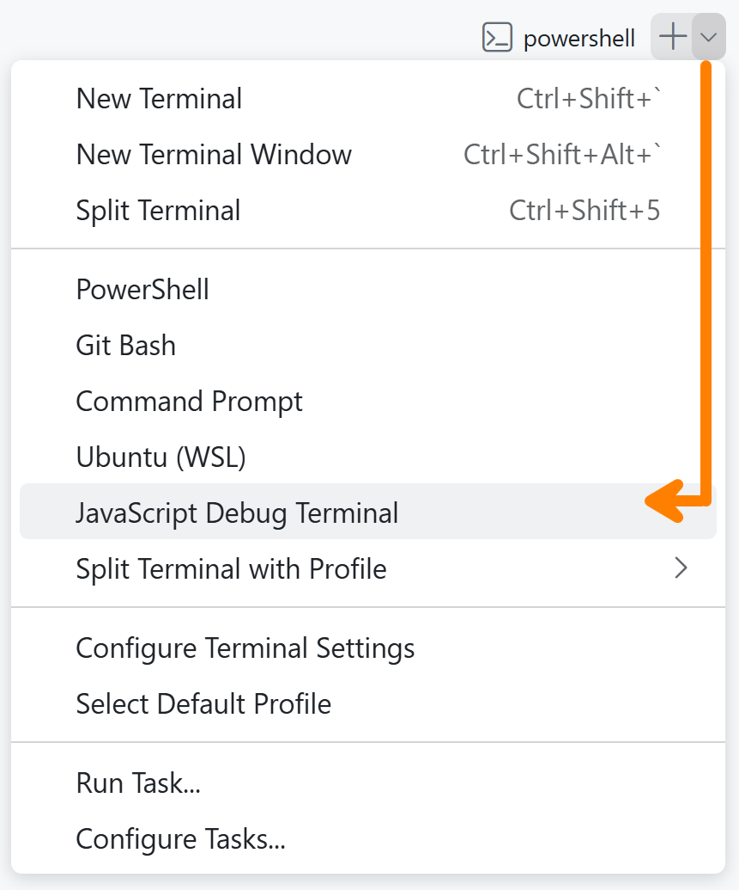

# JavaScript Quickstart

Are you looking to reinforce your JavaScript fundamentals from the ground up? Then a great place to start is to do the following set of JavaScript Quickstart tutorials! These focus on JavaScript by itself - no HTML or CSS to muddy the waters.

- [ ] [Intro to JavaScript](https://dgilleland.github.io/CPSC-1520/tutorials/0012/) &ndash; This is the starting point for the JavaScript Quickstart series where we learn how to run JavaScript *without* HTML, CSS, or even a browser.
- [ ] [JavaScript Math](https://dgilleland.github.io/CPSC-1520/tutorials/0014/)
- [ ] [Manipulate Strings](https://dgilleland.github.io/CPSC-1520/tutorials/0015/)
- [ ] [Complex Data Types](https://dgilleland.github.io/CPSC-1520/tutorials/0016/)
- [ ] [Functions](https://dgilleland.github.io/CPSC-1520/tutorials/0017/)
- [ ] [More Objects](https://dgilleland.github.io/CPSC-1520/tutorials/0018/)

----

## Running JavaScript with `node --watch`

You can explore JavaScript without any other web files (HTML/CSS) or even a web server! This is possible by using NodeJS.

To run a single JavaScript file in your workbook using Node, do the following:

1. Open a new terminal in VS Code.
2. Change to this directory: `cd src/js-quickstart`
3. Run your script in watch mode. For example, if you have a file named `sandbox.js`, you can run it by entering `node --watch sandbox.js`.
4. Now, you can position your terminal and your JavaScript file side-by side and watch what happens as you edit and save your code!

## Debugging

You can also open a JavaScript Debug Terminal and use breakpoints along with VS Code's built-in debugging tools. It's the same steps as above, but you begin with selecting **`JavaScript Debug Terminal`** from the terminal's drop-down.

To put a breakpoint on a line of code, simply click on the left of any line number of your code (this area is called the gutter) to toggle breakpoints on and off.

To learn more about debugging, see [Debug code with Visual Studio Code](https://code.visualstudio.com/docs/debugtest/debugging) [Node.js debugging in VS Code](https://code.visualstudio.com/docs/nodejs/nodejs-debugging).
